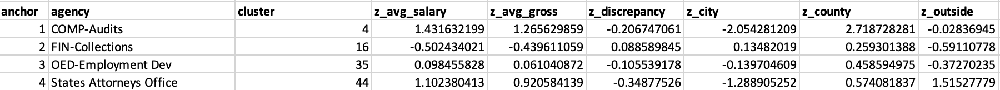
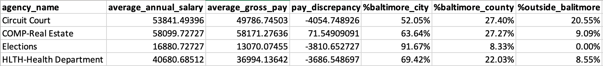

# Salaries and Residency of Baltimore City Employees - Cluster Analysis

## Background
City government serves as a major source of employment for many residents of metropolitan areas. With employment opportunities ranging from the fire department to crossing guards, public service positions provide jobs for a diverse range of people with different qualifications and backgrounds. Although city employees typically tend to reside within the city, it is not uncommon for people to commute to work from surrounding areas outside of the city limits.

With its large suburban surroundings and expansive city government, Baltimore serves as a perfect example of the wide variety of public employment opportunities and employee characteristics that define many urban areas. This analysis seeks to determine if Baltimore City's public agencies can be grouped into clusters based on various statistics: average salaries, gross salaries, discrepancy between salary and gross pay, and area of residence. This data will be used to complete a data analysis that separates Baltimore City's agencies into clusters centered around four distinct focus points.

## Business Question
_**Can the Baltimore City public employment agencies be grouped according to the salaries and residences of their employees?**_

## Data Question - Open Data

All of the data used in this project was gathered from the [City Government tab](https://data.baltimorecity.gov/browse?category=City+Government) of [Open Baltimore's](https://data.baltimorecity.gov/) public data.

**Open Baltimore** is an up-to-date open data source released by the city of Baltimore. It hosts datasets that range in topic from crime to transportation, and serves as a reliable source of open data for analysis of the city's statistics.

The folder containing the original data files can be found in the repository [here](https://github.com/a31kim/baltimore-salaries-residency-clusters/tree/main/original_data), or individually below.
1. [Employee Salaries Data](https://github.com/a31kim/baltimore-salaries-residency-clusters/blob/main/original_data/raw_salaries.xlsx)
2. [Employee Residency Data](https://github.com/a31kim/baltimore-salaries-residency-clusters/blob/main/original_data/raw_residency.xlsx)

The residency data is only available for 2012, so only the salaries data was restricted to only its 2012 values in order to maintain consistency.

## Data Question - Analysis

Microsoft Excel was used to answer:
* **Can the data be effectively grouped around distinguishable cluster points?** Used Excel's built-in Solver tool to conduct a four-point cluster analysis, and subsequently analyzed the data to ensure that they are significantly different from each other.
* **What distinguishable groupings have emerged?** Comparing the related data in order to determine the numerical characteristics of each cluster point.

## Data Answer

The data is difficult to display graphically due to the multi-variable nature of the dataset. Instead, I have picked out a few key values that effectively represent the results of the cluster analysis, and the groupings generated by the Solver tool.

### Salaries

The full salaries dataset can be found [here](https://github.com/a31kim/baltimore-salaries-residency-clusters/blob/main/original_data/raw_salaries.xlsx). The data was edited to only include 2012, since the residency data only contains data from 2012. The revised data, which contains only the relevant columns, can be found [here](https://github.com/a31kim/baltimore-salaries-residency-clusters/blob/main/mini_project_3.xlsx) on the "salaries_2012" tab. 

### Residency

The full salaries dataset can be found [here](https://github.com/a31kim/baltimore-salaries-residency-clusters/blob/main/original_data/raw_residency.xlsx). The revised data, which contains only the relevant columns, can be found [here](https://github.com/a31kim/baltimore-salaries-residency-clusters/blob/main/mini_project_3.xlsx) on the "salaries_2012" tab.

### Cluster Analysis

The values chosen for analysis were average annual salary, average gross pay, pay discrepancy, percent residing in Baltimore city, percent residing in Baltimore County, and percent residing outside of Baltimore.

The intial, randomly chosen cluster points are shown in the below image.

Following the standardization and minimum distance calculations, a four-point cluster analysis was performed using the Solver tool. The resulting cluster points and their related datapoints can be seen in the below image.

**Cluster Point Characteristics**
* _Circuit Court_: High salary, large pay discrepancy, relatively high percent reside outside of Baltimore
* _COMP-Real Estate_: Highest salary, only agency with positive discrepancy, mostly in Baltimore
* _Elections_: Lowest salary, large pay discrepancy, entirely in Baltimore
* _HLTH-Health Department_: Medium salary, mild pay discrepancy, mostly in Baltimore

The above characteristics demonstrate a significant difference in characteristics between each of the generated cluster points. Thus, it is not unreasonable to assume that each individual point from the dataset can largely be grouped into one of these four categories.

**Observations**
* These results seem to imply that the vast majority of city government employees reside within Baltimore city or Baltimore County.
* The only cluster point with a positive pay discrepancy (gross minus annual pay) is the _COMP-Real Estate_ agency, which has the highest average salary and consists of almost entirely Baltimore residents. In direct contrast, the _Elections_ agency has the lowest average salary and is based completely in Baltimore. This seems to imply that area of residence doesn't have a particularly large impact on grouping.
* The Health Department cluster values seems to be right in the middle of the other points. This might imply that a third cluster is unnecessary, and that three cluster groups would have been sufficient.

## Data Application and Business Answer

The main objective of this project was to determine whether or not the Baltimore City public employment agencies could be put into disctinctive groups based on their salaries and areas of residence. I was interested in determining if a distinctive bias in salary statistics towards predominantly Baltimore-residing employees. Surprisingly, the opposite seemed to emerge: the Elections cluster point, whose employees are entirely based in Baltimore, have the lowest average salary out of the four points and a relatively large pay discrepancy. In contrast, the Circuit Court cluster point, which has the highest percentage of non-Baltimore residing employees out of the four points, has a much higher average salary and a similar pay discrepancy. However, the COMP-Real Estate cluster point seems to invalidate this relationship entirely, as it has the highest salary out of the group, has the only positive pay discrepancy, and consists of mostly Baltimore-residing employees.

These contradicting results seem to indicate that the objective of the project was not entirely achieved - although the cluster groups seem to be sufficiently different from each other, the cumulative results are mostly inconclusive. This may be due to the lack of relationship between the salary dataset and the residency dataset. However, it is worth noting that some patters emerged out of the cluster analysis. For example, the concentration of high-salaried, predominantly Baltimore-residing agencies around the COMP-Real Estate cluster point may demonstrate some sort of bias towards employees that live in the city. Similarly, the agencies clustered around the Circuit Court point may be experiencing a larger pay discrepancy in relation to their higher percentage of residence outside of Baltimore. Perhaps this also relates to the time commuting, and work hours lost by being stuck in traffic. Regardless, the data generated from this analysis is still useful in interpreting hiring practices and salary discrimination despite its flaws.

In summation, the primary goal of effectively grouping the agencies into four distinctive groups through cluster analysis was mildly successful. The cluster points demonstrate visible differences in values, and the Solver tool was able to conclusively minimize the distance from individual points to the four cluster points it chose. However, a qualitative analysis of the generated cluster points seems to indicate that the data may not be entirely conclusive. In spite of this, reliable conclusions can be drawn from the data analysis regarding the various salary and residency characteristics that Baltimore City's governmental agencies demonstrate.
