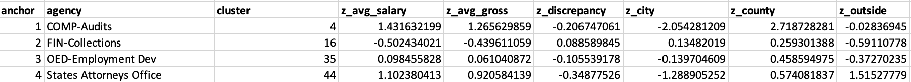
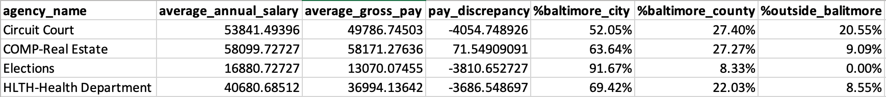

# Salaries and Residency of Baltimore City Employees - Cluster Analysis

## Background
City government serves as a major source of employment for many residents of metropolitan areas. With employment opportunities ranging from the fire department to crossing guards, public service positions provide jobs for a diverse range of people with different qualifications and backgrounds. Although city employees typically tend to reside within the city, it is not uncommon for people to commute to work from surrounding areas outside of the city limits.

With its large suburban surroundings and expansive city government, Baltimore serves as a perfect example of the wide variety of public employment opportunities and employee characteristics that defines many urban areas. This analysis seeks to determine if Baltimore City's public agencies can be grouped into clusters based on various statistics: average salaries, gross salaries, discrepancy between average and gross pay, and residency. This data will be used to complete a cluster analysis that separates Baltimore City's agencies into clusters centered around distinct focus points.

## Business Question
_**Can the Baltimore City public employment agencies be grouped according to the salaries and residences of their employees?**_

## Data Question - Open Data

All of the data used in this project was gathered from the [City Government tab](https://data.baltimorecity.gov/browse?category=City+Government) of [Open Baltimore's](https://data.baltimorecity.gov/) public data.

**Open Baltimore** is an up-to-date open data source released by the city of Baltimore. It hosts datasets that range in topic from crime to transportation, and serves as a reliable source of open data for analysis of the city's statistics.

The folder containing the original data files can be found in the repository [here](https://github.com/a31kim/baltimore-salaries-residency-clusters/tree/main/original_data), or individually below.
1. [Employee Salaries Data](https://github.com/a31kim/baltimore-salaries-residency-clusters/blob/main/original_data/raw_salaries.xlsx)
2. [Employee Residency Data](https://github.com/a31kim/baltimore-salaries-residency-clusters/blob/main/original_data/raw_residency.xlsx)

The residency data is only available for 2012, so only the salaries data was restricted to only its 2012 values in order to maintain consistency.

## Data Question - Analysis

Microsoft Excel was used to answer:
* **Can the data be effectively grouped around distinguishable cluster points?** Used Excel's built-in Solver tool to conduct a four-point cluster analysis, and subsequently analyzed the data to ensure that they are significantly different from each other.
* **What distinguishable groupings have emerged?** Comparing the related data in order to determine the numerical characteristics of each cluster point.

## Data Answer

The data is difficult to display graphically due to the multi-variable nature of the dataset. Instead, I have picked out a few key values that effectively represent the results of the cluster analysis, and the groupings generated by the Solver tool.

### Salaries

The full salaries dataset can be found [here](https://github.com/a31kim/baltimore-salaries-residency-clusters/blob/main/original_data/raw_salaries.xlsx). The data was edited to only include 2012, since the residency data only contains data from 2012. The revised data, which contains only the relevant columns, can be found [here](https://github.com/a31kim/baltimore-salaries-residency-clusters/blob/main/mini_project_3.xlsx) on the "salaries_2012" tab. 

### Residency

The full salaries dataset can be found [here](https://github.com/a31kim/baltimore-salaries-residency-clusters/blob/main/original_data/raw_residency.xlsx). The revised data, which contains only the relevant columns, can be found [here](https://github.com/a31kim/baltimore-salaries-residency-clusters/blob/main/mini_project_3.xlsx) on the "salaries_2012" tab.

### Cluster Analysis

The values chosen for analysis were average annual salary, average gross pay, pay discrepancy, percent residing in Baltimore city, percent residing in Baltimore County, and percent residing outside of Baltimore.

The intial, randomly chosen cluster points are shown in the below image.

Following the standardization and minimum distance calculations, a four-point cluster analysis was performed using the Solver tool. The resulting cluster points and their related datapoints can be seen in the below image.

**Cluster Point Characteristics**
* _Circuit Court_: High salary, large pay discrepancy, relatively high percent reside outside of Baltimore
* _COMP-Real Estate_: Highest salary, only agency with positive discrepancy, mostly in Baltimore
* _Elections_: Lowest salary, large pay discrepancy, entirely in Baltimore
* _HLTH-Health Department_: Medium salary, mild pay discrepancy, mostly in Baltimore

The above characteristics demonstrate a significant difference in characteristics between each of the generated cluster points. Thus, it is not unreasonable to assume that each individual point from the dataset can largely be grouped into one of these four categories.

**Observations**
* These results seem to imply that the vast majority of city government employees reside within Baltimore city or Baltimore County.
* The only cluster point with a positive pay discrepancy (gross minus annual pay) is the _COMP-Real Estate_ agency, which has the highest average salary and consists of almost entirely Baltimore residents. In direct contrast, the _Elections_ agency has the lowest average salary and is based completely in Baltimore. This seems to imply that area of residence doesn't have a particularly large impact on grouping.
* The Health Department cluster values seems to be right in the middle of the other points. This might imply that a third cluster is unnecessary, and that three cluster groups would have been sufficient

## Data Application and Business Answer

The data analysis presented in this project numerically demonstrates the qualitative assertion that racial demographics and incarceration rates of an area are significantly correlated with its predicted average household income. While it would be too presumptive to describe this relationship as causal, it is worth noting the incidence of mass incarceration and significant racial discrimination in many metropolitan areas. The regression model implies that communities with higher rates of non-white residents and incarceration are much more likely to have limited access to the same economic opportunities available to more white, lower crime areas within the same city. It is perhaps worth investigating the mutli-faceted nature of this phenomenon, such as the role of inadequate educational and employment services.

In addition to the general conclusions that can be drawn from this project, a comparison between the two cities' regression models yields an interesting difference worth noting. Compared to D.C., the equation produced by the Baltimore dataset regression indicates a much smaller effect of the percentage of non-white residents on income. In short, race seems to play a much larger role in determining household income in D.C. than in Baltimore. While this project does not currently seek to examine the reasoning behind this, it could possibly be related to the lower percentage of Whites in Baltimore [29.6%](https://en.wikipedia.org/wiki/History_of_White_Americans_in_Baltimore#:~:text=By%20the%201990%20United%20States,%25%20was%20non%2DHispanic%20white.) compared to [42.2%](https://en.wikipedia.org/wiki/Demographics_of_Washington,_D.C.#:~:text=According%20to%202018%20US%20Census,from%20two%20or%20more%20races.) in D.C. Perhaps the larger population of non-whites in Baltimore has simply resulted in a larger dispersion of income across the group.

In summation, this data analysis has effectively demonstrated a significant relationship between racial demographics/incarceration rates, and average household income. The sharp contrast between neighborhoods in D.C. like Georgetown ($67,000 average income, 0.5% incarceration, 14% non-white) and Brightwood Park ($30,830 average income, 3.6% incarceration, 95% non-white) is clear. The same dichotomy exists in Baltimore, with neighborhoods like Mount Washington ($70,000 average income, ~0% incarceration, 20% non-white) and Lakeland ($26,000 average income, 3.6% incarceration, 78% non-white). Anecdotal evidence aside, racial demographics and incarceration rates are clearly directly correlated with the average household income of an area in these two cities.
